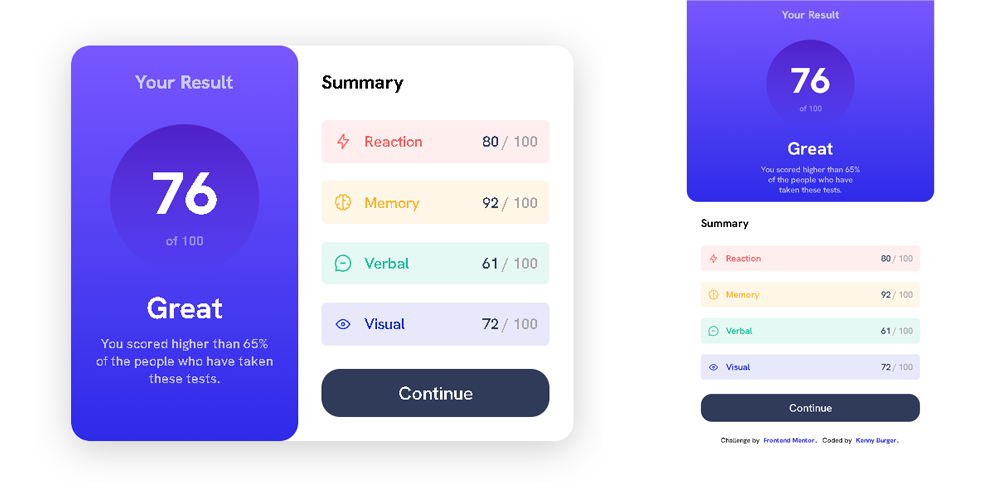

# Frontend Mentor - Results summary component solution

This is a solution to the [Results summary component challenge on Frontend Mentor](https://www.frontendmentor.io/challenges/results-summary-component-CE_K6s0maV).

## Table of contents

- [Overview](#overview)
  - [The challenge](#the-challenge)
  - [Screenshot](#screenshot)
  - [Links](#links)
  - [Built with](#built-with)
- [Author](#author)

## Overview

### The challenge

Users should be able to:

- View the optimal layout for the interface depending on their device's screen size
- See hover and focus states for all interactive elements on the page

### Screenshot

### Links

Live Site URL: [Preview](https://icxless.github.io/Results-Summary-Component-Frontend-Mentor-Challenge/)

### Built with

- HTML5
- CSS
- Flexbox
- CSS Grid

## Author

- Frontend Mentor - [@icxless](https://www.frontendmentor.io/profile/Icxless)
