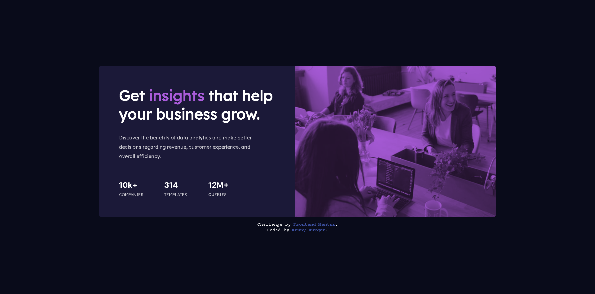

# Frontend Mentor - Stats preview card component solution

- [Live Site URL](https://4-icx-stats-preview-card-component-main.pages.dev/)
- [Solution URL](https://www.frontendmentor.io/solutions/responsive-card-using-flexbox-Mz388h71L0)

## Welcome 👋

Thanks for checking out this front-end coding challenge.

This is a solution to the [Stats preview card component](https://www.frontendmentor.io/challenges/stats-preview-card-component-8JqbgoU62/hub).

## Table of contents

- [Overview](#overview)
  - [The challenge](#the-challenge)
  - [Screenshot](#screenshot)
  - [Built with](#built-with)
- [Author](#author)

## Overview

### The challenge

Users should be able to:

- View the optimal layout depending on their device's screen size

### Screenshot

### Built with

- HTML5
- CSS
- Flexbox

## Author

Frontend Mentor - [@icxless](https://www.frontendmentor.io/profile/Icxless)
