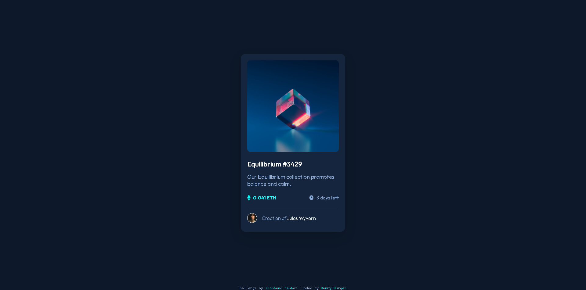

# Frontend Mentor - Results NFT preview card component
- [Live Site URL](https://icx-5-nft-preview-card-component-main.pages.dev/)
- [Solution URL](https://www.frontendmentor.io/solutions/nft-card-using-flexbox-5vu6h36VP6)

## Welcome 👋

Thanks for checking out this front-end coding challenge.

This is a solution to the [NFT preview card component](https://www.frontendmentor.io/challenges/nft-preview-card-component-SbdUL_w0U).

## Table of contents

- [Overview](#overview)
  - [The challenge](#the-challenge)
  - [Screenshot](#screenshot)
  - [Built with](#built-with)
- [Author](#author)

## Overview

### The challenge

Users should be able to:

- View the optimal layout depending on their device's screen size
- See hover states for interactive elements

### Screenshot

### Built with

- HTML5
- CSS
- Flexbox

## Author

Frontend Mentor - [@icxless](https://www.frontendmentor.io/profile/Icxless)
